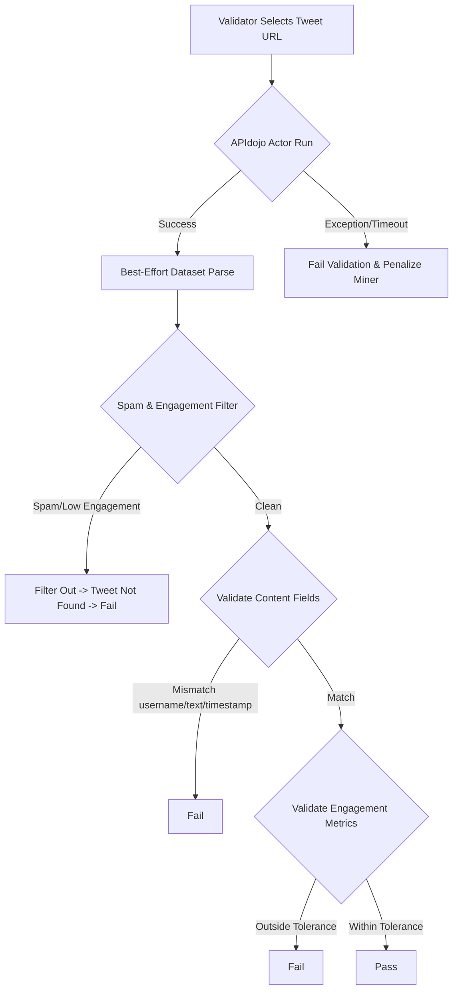

# Bittensor Subnet 13 Scraper & Validation Analysis

This document provides a detailed code analysis of Bittensor Subnet 13 (Data Universe) scrapers and validation logic, focusing on X (Twitter) and Reddit. It analyzes why validation failures occur (both false negatives and genuine discrepancies) and provides concrete recommendations on how to modify the scrapers/validators to improve validation success rates.

---

## 1. Subnet 13 Validation Architecture Overview

Subnet 13 validators score miners based on two primary mechanisms:
1. **P2P/Metagraph Validation**: Validators query miners for a sample data bucket (`GetDataEntityBucket`) chosen from the miner's index. They then validate a random sample (typically 1 or 2 entities) by scraping the live URL using preferred scrapers.
2. **On-Demand (OD) Validation**: Validators download a miner's on-demand upload from S3 and perform schema validation, job matching, and live scraper checks.

The preferred scrapers for validation are defined in `vali_utils/miner_evaluator.py`:
- **X (Twitter)**: `ScraperId.X_APIDOJO` (`ApiDojoTwitterScraper` using Apify Actor `61RPP7dywgiy0JPD0`)
- **Reddit**: `ScraperId.REDDIT_MC` (`RedditMCScraper` using Apify Actor `macrocosmos/reddit-scraper`)

---

## 2. X (Twitter) Scraper Code Analysis & Issues

The primary validator-side logic resides in `scraping/x/apidojo_scraper.py` and `scraping/x/utils.py`.



### Key Validation Steps and Failure Modes

### A. Apify Actor Reliance & Hard Failure Penalty
In `apidojo_scraper.py` (lines 65-84):
- **Code**:
  ```python
  try:
      dataset: List[dict] = await self.runner.run(run_config, run_input)
  except Exception as e:
      if attempt != max_attempts:
          continue
      else:
          # ...
          return ValidationResult(
              is_valid=False,
              reason="Failed to run Actor. This can happen if the URI is invalid, or APIfy is having an issue.",
              content_size_bytes_validated=entity.content_size_bytes,
          )
  ```
- **Issue**: If the validator's Apify API token runs out of funds, hits rate limits, or Apify itself is down, the validator returns `is_valid=False` and **penalizes the miner** (assigns a score of 0 for that check). This leads to a high rate of false validation failures due to infrastructure issues rather than miner dishonesty.

### B. Spam Account and Low Engagement Filters
In `apidojo_scraper.py`, `_best_effort_parse_dataset` filters the scraped tweets if `check_engagement` is enabled (the default for P2P evaluation):
- **Spam Account Check (`utils.is_spam_account`)**:
  - Requires: follower count $\ge$ 50, account age $\ge$ 30 days, follower-to-following ratio $\le$ 10, bio, and profile picture.
- **Low Engagement Check (`utils.is_low_engagement_tweet`)**:
  - Requires: view count $\ge$ 500 (or $\ge$ 1000 for replies).
  - Requires: total engagement ratio (likes + retweets + replies + quotes) / views $\ge$ 0.5%.
- **Issue**:
  - **Dynamics**: Tweets mined by the miner might drop in views (due to Twitter CDN adjustments) or the author account might temporarily fall below the follower threshold.
  - **Missing Tweet**: If a tweet is filtered out by these checks on the validator side, `actual_tweet` is marked `None`, and the miner fails validation with the reason `"Tweet not found or is invalid."`

### C. The Engagement Range Logic Bug
In `scraping/x/utils.py` (lines 726-738):
- **Code**:
  ```python
  min_allowed_value = max(0, submitted_value - small_tolerance)
  max_allowed_value = submitted_value + tolerance

  # Validate engagement is within reasonable bounds - binary pass/fail
  if not (min_allowed_value <= submitted_value <= max_allowed_value):
      # Logs failure and returns is_valid=False
  ```
- **Bug**: The code checks if `submitted_value` is between `min_allowed_value` and `max_allowed_value`. However, both bounds are mathematically constructed from `submitted_value` itself:
  $$submitted\_value - small\_tolerance \le submitted\_value \le submitted\_value + tolerance$$
  This condition is **always true**, meaning the validator currently *never* rejects miners for their engagement values being too low compared to the live scraped value. If this logic is fixed in future updates, many miners who do not actively scrape and update their stored views/likes/retweets will suddenly fail validation.

---

## 3. Reddit Scraper Code Analysis & Issues

The primary Reddit validator logic is in `scraping/reddit/reddit_mc_scraper.py` and `scraping/reddit/utils.py`.

### Key Validation Steps and Failure Modes

### A. Reddit Blocking & APify Actor Timeouts
In `reddit_mc_scraper.py` (lines 121-130):
- **Code**:
  ```python
  actor_input = { "url": ent_content.url }
  run = await self.client.actor(self.ACTOR_ID).call(
      run_input=actor_input,
      timeout_secs=300
  )
  ```
- **Issue**: Reddit is aggressive about blocking Apify IPs. The actor frequently times out or returns empty results, causing the validator to mark the entity as `"URL not found or inaccessible."` and penalize the miner.

### B. Score and Comment Count Dynamic Deviations
Reddit score (upvotes) and comment counts change rapidly. The validator uses age-based scaling:
- **Tolerances**:
  - Fresh posts (< 1 hour): 50% score tolerance, min tolerance 10.
  - Week-old posts (< 7 days): 150% score tolerance, min tolerance 50.
- **Ratio Check**: `_validate_comment_score_ratio` checks comment-to-score ratio. If comments/score > 5.0 (for score > 10), it fails as "Suspicious ratio".
- **Issue**: Highly controversial posts or posts targeted by bot discussions will naturally exceed these ratios. Furthermore, if a miner does not keep their indexed database fresh, the live score will exceed the validator's tolerance ranges.

---

## 4. How to Modify X and Reddit Scrapers to Improve Validation Success Rate

To maximize the validation success rate and minimize false penalties/discrepancies, modifications should be made on both the **Validator side** (for robustness) and the **Miner side** (for compliance).

### Proposed Modifications for Validators

#### 1. Implement Fallback Scraper Chaining
If the primary Apify scraper fails to run or times out, the validator should attempt to fetch the URL using a secondary scraper before penalizing the miner.

- **For X (Twitter)**: Chain `ApiDojoTwitterScraper` $\rightarrow$ `QuackerUrlScraper` or `MicroworldsTwitterScraper`.
- **For Reddit**: Chain `RedditMCScraper` $\rightarrow$ `RedditJsonScraper` (which queries `.json` endpoints directly without using Apify actors).

*Example validator modification in `miner_evaluator.py`*:
```python
# In MinerEvaluator.eval_miner
scraper = self.scraper_provider.get(...)
validation_results = await scraper.validate(entities_to_validate)

# If validation fails due to Actor failure, attempt backup:
for i, result in enumerate(validation_results):
    if not result.is_valid and "Failed to run Actor" in result.reason:
        # Fallback to alternative scraper
        backup_scraper = self.scraper_provider.get(ScraperId.X_QUACKER)
        backup_results = await backup_scraper.validate([entities_to_validate[i]])
        if backup_results[0].is_valid:
            validation_results[i] = backup_results[0]
```

#### 2. Neutral Treatment of Infrastructure/Server Failures
If the scraper actor returns an error code representing a validator-side rate limit or proxy block (e.g., HTTP 429/503/504), the validator should **skip** (neither reward nor penalize) this check instead of assigning a hard failure.

*Example modification*:
```python
# In api_client or scrapers, catch HTTP 429/5xx and return None to signal skip:
if dl_resp.status_code >= 500 or dl_resp.status_code == 429:
    return ValidationResult(
        is_valid=True, # Or handle as neutral/skipped in evaluator.py
        reason="Skipped: Validator-side rate-limit/server error",
        content_size_bytes_validated=0
    )
```

#### 3. Align Low Engagement and Spam Settings
If the validator's spam/low-engagement parameters are updated, they must be broadcasted or versioned so that miners do not scrape and index posts that will be immediately filtered out by the validator's sanitization rules.

---

### Proposed Modifications for Miners

Miners must configure their scrapers to produce data that perfectly matches the validator's expectations.

#### 1. Pre-filter Mined Data using Validator Rules
Before writing to local storage and uploading to S3, the miner's scraper pipeline must apply the exact same spam and engagement checks used by the validator. This prevents the miner from indexing tweets/posts that the validator will reject.

*Miners should import or duplicate `is_spam_account` and `is_low_engagement_tweet` from `scraping/x/utils.py` and filter scraped items:*
```python
# Miner pipeline check
if is_spam_account(tweet["author"]) or is_low_engagement_tweet(tweet):
    continue # Skip indexing this tweet
```

#### 2. Enforce DateTime Obfuscation
The validator strictly verifies that timestamps are obfuscated to the minute (seconds and microseconds = 0). Miners must guarantee this during serialization.

*obfuscate datetime on miner side*:
```python
# In miner serialization:
dt_obfuscated = original_dt.replace(second=0, microsecond=0)
```

#### 3. Implement Active Metric Refreshing
Since scores, views, and comment counts are dynamic, miners must periodically rescrape active posts (e.g., those scraped in the last 48 hours) to update their scores in the local database. If a validator selects a 12-hour-old post, the miner's submitted score must match the live score within the validator's age-based tolerance percentage.

*Recommended Cron for Miners*:
- **Age < 6 hours**: Rescrape every 30 minutes.
- **Age < 24 hours**: Rescrape every 2 hours.
- **Age < 7 days**: Rescrape every 12 hours.

---

## 5. Summary of Recommended Actions

| Problem | Root Cause | Target | Solution |
| :--- | :--- | :--- | :--- |
| **Apify actor run failure** | Rate limits, billing limits, proxy blocks on validators | Validator | Implement scraper fallbacks; treat validator network errors as "Neutral/Skip" instead of "Fail". |
| **Tweet not found** | Spam/engagement filters strip tweets on validator side | Miner | Pre-filter scraped tweets using validator spam thresholds before indexing. |
| **Metric mismatch** | Dynamic views, likes, and scores change over time | Miner | Run a cron job to update metric counts for active/recent posts. |
| **Obfuscation failure** | Timestamp seconds/microseconds mismatch | Miner | Strictly obfuscate all `created_at` and `scraped_at` timestamps to the minute. |
| **Validation Bug** | Bug in `_validate_engagement_field` | Subnet Owner | Correct `submitted_value` comparison to `actual_value` in validator logic. |

---
